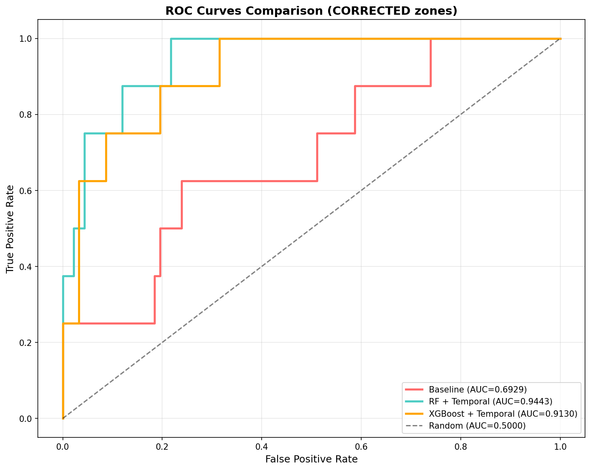
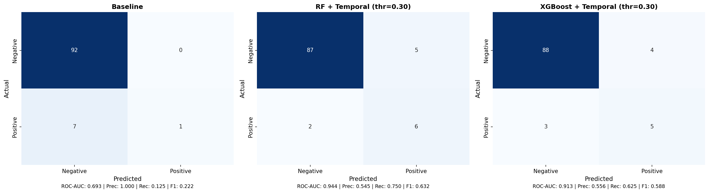

# Sleep Apnea Detection using Pressure Mat and Machine Learning

A complete machine learning pipeline for detecting sleep apnea events using non-invasive pressure mat sensor data.

## Overview

This project implements an end-to-end solution for sleep apnea detection using:
- **40-channel pressure mat** (4×10 sensor grid at 8 Hz)
- **6-axis accelerometer** (dual 3-axis sensors)
- **Machine learning classifiers** (Random Forest, XGBoost)
- **Temporal feature engineering** (key innovation for improved detection)

### Key Results

| Model | ROC-AUC (CV) | Improvement |
|-------|-------------|-------------|
| Baseline (zone features only) | 0.657 ± 0.073 | - |
| **RF + Temporal Features** | **0.827 ± 0.079** | **+26.0%** |
| **XGBoost + Temporal Features** | **0.830 ± 0.058** | **+26.3%** |

> **Key finding**: Temporal features (delta, rolling statistics, trends) capture breathing dynamics and dramatically improve detection performance.

## Results

### ROC Curves Comparison


### Confusion Matrices


### Performance Summary

**Single Train/Test Split:**
```
Model                             ROC-AUC   F1-Score  Precision  Recall
------------------------------------------------------------------------
Baseline                           0.693     0.222     1.000     0.125
RF + Temporal (K=60)               0.944     0.632     0.545     0.750
XGBoost + Temporal (K=60)          0.913     0.588     0.556     0.625
```

**5-Fold Cross-Validation (GroupKFold by subject):**
```
Model                          ROC-AUC (mean ± std)
----------------------------------------------------
Baseline                       0.657 ± 0.073
RF + Temporal                  0.827 ± 0.079
XGBoost + Temporal             0.830 ± 0.058
```

## Project Structure

```
sleep-apnea-detection/
├── README.md                 # This file
├── requirements.txt          # Python dependencies
├── src/
│   ├── prepare_dataset.py    # Data preprocessing pipeline (Steps 1-5)
│   ├── run_complete_analysis.py  # Full ML analysis (Steps 6-12)
│   ├── cross_validation_analysis.py  # Detailed CV analysis
│   └── visualize_matrix_layout.py    # Sensor layout visualization
├── results/
│   ├── roc_curves_CORRECTED.png
│   └── confusion_matrices_CORRECTED.png
└── docs/
    └── Firmware - Descrizione Protocollo v3.pdf  # Hardware documentation
```

## Pipeline Architecture

```
┌─────────────────────────────────────────────────────────────────────────┐
│                        DATA PREPROCESSING                               │
├─────────────────────────────────────────────────────────────────────────┤
│  Step 1: Raw Data Loading                                               │
│          └── Pressure mat (40 ch × 8 Hz) + Accelerometer (6 ch)         │
│                                                                         │
│  Step 2: Windowing (30-second windows)                                  │
│          └── Label assignment (apnea vs non-apnea)                      │
│                                                                         │
│  Step 3: Feature Extraction                                             │
│          └── Per-channel: mean, std, diff_std                           │
│          └── Global: mean, std, min, max                                │
│                                                                         │
│  Step 4: Accelerometer Feature Extraction                               │
│          └── Same statistics for 6 ACC channels                         │
│                                                                         │
│  Step 5: Zone Aggregation (4×10 → 4 zones)                              │
│          └── UL (Upper Left), UR, LL, LR                                │
└─────────────────────────────────────────────────────────────────────────┘
                                    │
                                    ▼
┌─────────────────────────────────────────────────────────────────────────┐
│                        MACHINE LEARNING ANALYSIS                        │
├─────────────────────────────────────────────────────────────────────────┤
│  Step 6: Train/Test Split (by subject)                                  │
│                                                                         │
│  Step 7: Baseline Model (Random Forest)                                 │
│                                                                         │
│  Step 8: Temporal Feature Engineering                                   │
│          └── Delta (change from previous window)                        │
│          └── Rolling mean/std (3-window)                                │
│          └── Trend (deviation from rolling mean)                        │
│                                                                         │
│  Step 9: Feature Selection (SelectKBest, K=60)                          │
│                                                                         │
│  Step 10: RF + Temporal Features                                        │
│                                                                         │
│  Step 11: XGBoost + Temporal Features                                   │
│                                                                         │
│  Step 12: 5-Fold Cross-Validation (GroupKFold)                          │
└─────────────────────────────────────────────────────────────────────────┘
```

## Sensor Layout

The pressure mat uses a **4×10 channel grid** representing anatomical regions:

```
        A1   A2   A3   A4   A5   A6   A7   A8   A9   A10
      ┌────────────────────┬─────────────────────────────┐
  D1  │  1    2    3    4  │  5    6    7    8    9   10 │  ← Shoulders
  D2  │ 11   12   13   14  │ 15   16   17   18   19   20 │  ← Mid torso
      ├────────────────────┼─────────────────────────────┤
  D3  │ 21   22   23   24  │ 25   26   27   28   29   30 │  ← Abdomen
  D4  │ 31   32   33   34  │ 35   36   37   38   39   40 │  ← Pelvis
      └────────────────────┴─────────────────────────────┘
           Zone UL              Zone UR
           Zone LL              Zone LR
```

**Zone Definitions:**
- **UL (Upper Left)**: Channels 1-5, 11-15 (left chest/shoulder)
- **UR (Upper Right)**: Channels 6-10, 16-20 (right chest/shoulder)
- **LL (Lower Left)**: Channels 21-25, 31-35 (left abdomen/pelvis)
- **LR (Lower Right)**: Channels 26-30, 36-40 (right abdomen/pelvis)

## Feature Engineering

### Baseline Features (50 features)
- **Global statistics**: mean, std, min, max (pressure + accelerometer)
- **Zone aggregations**: For each zone (UL, UR, LL, LR):
  - Mean and std of channel means
  - Mean and std of channel stds
  - Mean and std of channel diff_stds (breathing variability)

### Temporal Features (52 features) - KEY INNOVATION
For 13 base features, we compute:
- **Delta**: `f(t) - f(t-1)` - Change from previous 30s window
- **Rolling mean**: 3-window moving average (90 seconds)
- **Rolling std**: 3-window moving standard deviation
- **Trend**: `f(t) - rolling_mean(t)` - Short-term deviation

> These temporal features capture the **breathing dynamics** that precede and characterize apnea events, leading to dramatic performance improvements.

### Feature Selection
- **SelectKBest** with ANOVA F-statistic
- **K=60** features selected (optimal from hyperparameter tuning)
- **8/10 top features are temporal** - confirming their importance

## Installation

```bash
# Clone the repository
git clone https://github.com/yourusername/sleep-apnea-detection.git
cd sleep-apnea-detection

# Create virtual environment
python3 -m venv venv
source venv/bin/activate  # On Windows: venv\Scripts\activate

# Install dependencies
pip install -r requirements.txt
```

## Usage

### 1. Data Preprocessing (if you have raw data)

```bash
cd src
python prepare_dataset.py
```

This will:
- Load raw pressure mat and accelerometer data
- Create 30-second labeled windows
- Extract statistical features
- Aggregate into anatomical zones
- Output: `preprocessing_output/dataset_windows_30s_features_zones_CORRECTED.csv`

### 2. Run Complete Analysis

```bash
python run_complete_analysis.py
```

This will:
- Train baseline and temporal models
- Compare RF vs XGBoost
- Run 5-fold cross-validation
- Generate visualizations in `results_analysis/`

### Expected Output

```
================================================================================
                            FINAL SUMMARY
================================================================================

📊 Single Train/Test Split Performance:
  Model                             ROC-AUC   F1-Score  Precision  Recall
  -------------------------------------------------------------------------
  Baseline                           0.6929     0.2222     1.0000   0.1250
  RF + Temporal (K=60)               0.9443     0.6316     0.5455   0.7500
  XGBoost + Temporal (K=60)          0.9130     0.5882     0.5556   0.6250

📊 5-Fold Cross-Validation Performance:
  Model                          ROC-AUC (mean±std)
  --------------------------------------------------
  Baseline                       0.6566 ± 0.0727
  RF+Temporal                    0.8272 ± 0.0787
  XGBoost+Temporal               0.8296 ± 0.0583
```

## Model Configuration

| Parameter | Value |
|-----------|-------|
| Random Forest | 400 trees, min_samples_leaf=3 |
| XGBoost | 400 estimators, max_depth=6, lr=0.1 |
| Feature Selection | SelectKBest, K=60 |
| Class Balancing | Random oversampling (minority class) |
| Classification Threshold | 0.30 (optimized for recall) |
| Cross-Validation | 5-fold GroupKFold (by subject) |

## Key Findings

1. **Temporal features are critical**: 8/10 most important features are temporal (delta, rolling, trend)

2. **Simple zone aggregation works well**: 4 anatomical zones (UL, UR, LL, LR) outperform complex zone schemes

3. **XGBoost slightly more stable**: Similar mean performance to RF, but lower variance across CV folds

4. **Subject-dependent performance**: CV range [0.70, 0.91] indicates significant inter-subject variability

5. **Single-split was optimistic**: Single split ROC-AUC 0.94 vs CV mean 0.83 - emphasizes importance of proper CV

## Dataset Information

- **Subjects**: 23 participants
- **Windows**: 557 (30-second each)
- **Class distribution**:
  - Non-apnea: 512 (91.9%)
  - Apnea: 45 (8.1%)
- **Sampling rate**: 8 Hz (pressure mat)
- **Window size**: 240 samples (30 seconds)

## Requirements

- Python 3.8+
- pandas >= 1.3.0
- numpy >= 1.20.0
- scikit-learn >= 1.0.0
- xgboost >= 1.5.0
- matplotlib >= 3.4.0
- seaborn >= 0.11.0

## Citation


## Acknowledgments

- Pressure mat sensor: 4×10 channel resistive sensor array
- Data collection: Clinical sleep study participants
- Framework: scikit-learn, XGBoost

---

**Note**: Raw data files are not included in this repository due to privacy considerations. Contact the author for data access requests.
