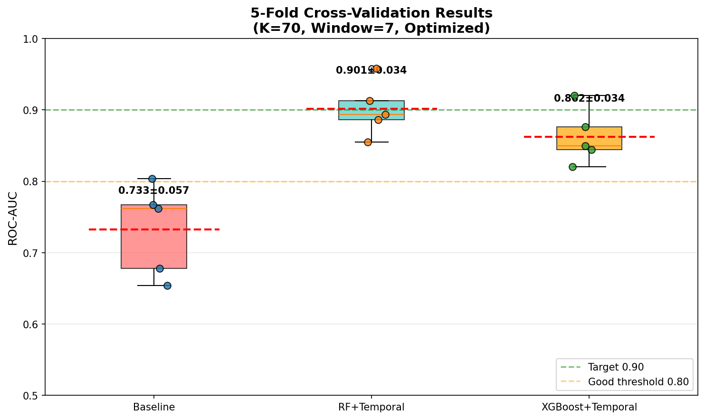
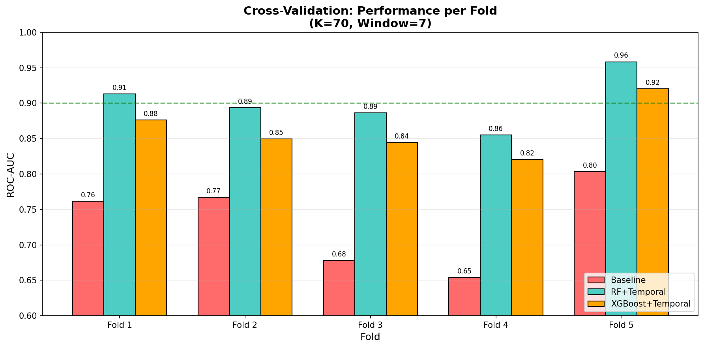
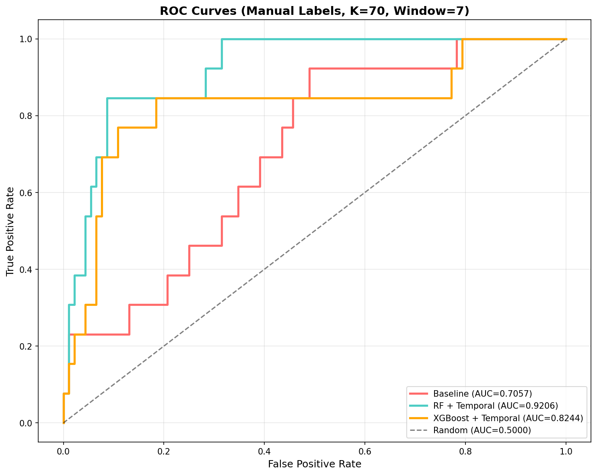
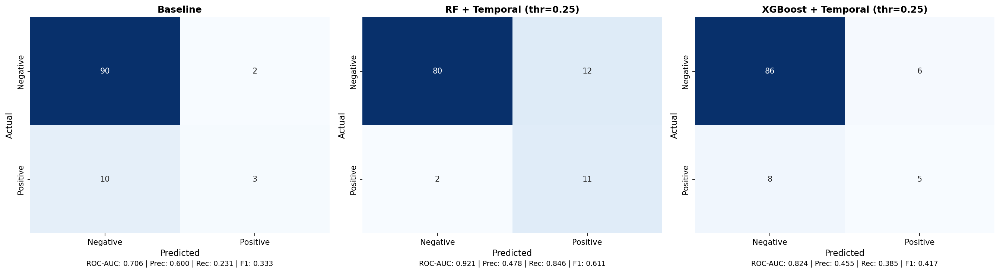
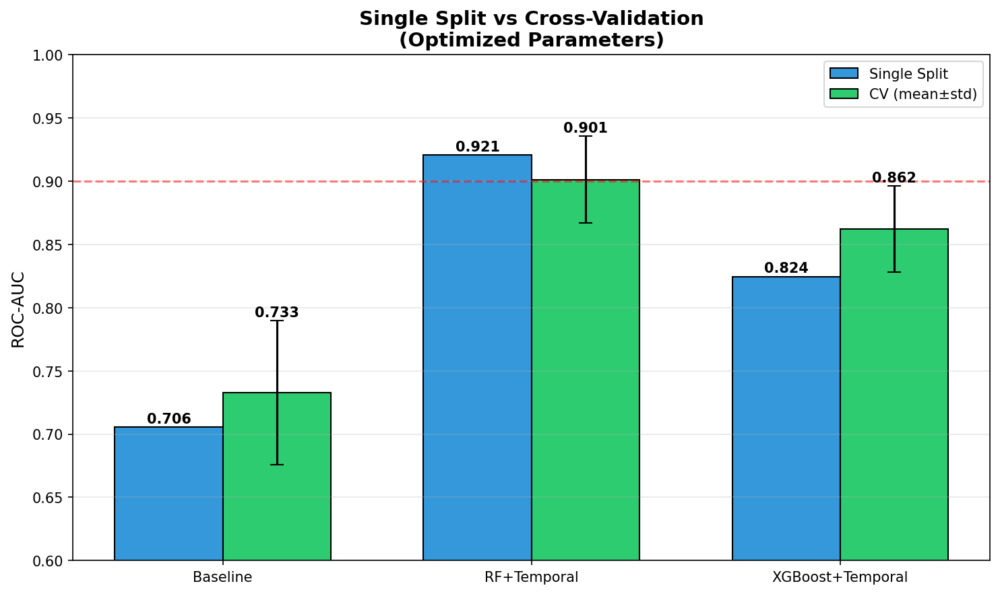
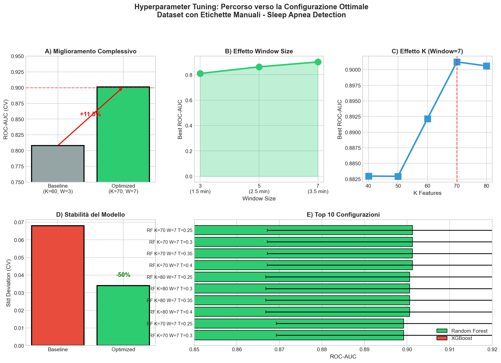
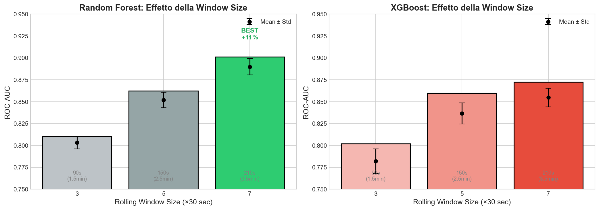
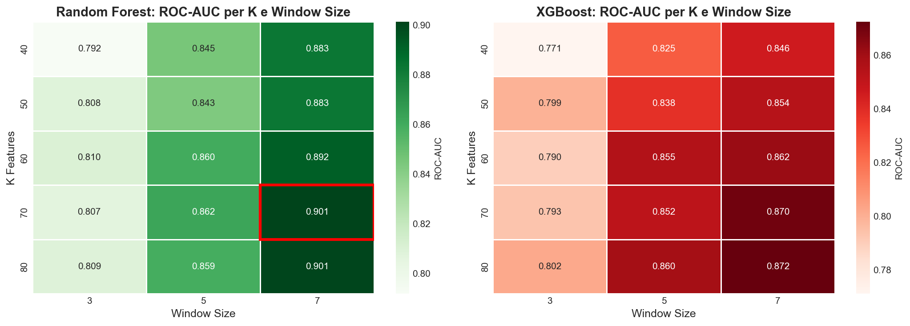

# Sleep Apnea Detection using Pressure Mat and Machine Learning

A complete machine learning pipeline for detecting sleep apnea events using non-invasive pressure mat sensor data.

## Overview

This project implements an end-to-end solution for sleep apnea detection using:
- **40-channel pressure mat** (4×10 sensor grid at 8 Hz)
- **6-axis accelerometer** (dual 3-axis sensors)
- **Machine learning classifiers** (Random Forest, XGBoost)
- **Temporal feature engineering** (key innovation for improved detection)

### Key Results

We evaluated our approach on two datasets: the original automatic-labeled dataset and a manually-labeled dataset with more accurate annotations.

#### Best Results (Manual Labels Dataset + Optimized Parameters)

| Model | ROC-AUC (CV) | F1-Score | Recall |
|-------|-------------|----------|--------|
| Baseline | 0.733 ± 0.057 | 0.33 | 23% |
| **RF + Temporal Features** | **0.901 ± 0.034** | **0.61** | **85%** |
| XGBoost + Temporal Features | 0.862 ± 0.034 | 0.42 | 38% |

> **Key achievement**: ROC-AUC > 0.90 with 85% recall using optimized temporal features on the manually-labeled dataset.

#### What is the Baseline?

The **Baseline model** is a Random Forest classifier trained using only the **static zone features** (50 features):
- Global pressure statistics (mean, std, min, max)
- Zone-aggregated features (UL, UR, LL, LR regions)
- Accelerometer statistics

The baseline does **NOT** include temporal features (delta, rolling statistics, trends). This allows us to measure the specific contribution of temporal feature engineering, which captures breathing dynamics over time and dramatically improves detection performance.

## Results Comparison

### Original Dataset vs Manual Labels Dataset

| Metric | Original Dataset | Manual Labels (Optimized) | Improvement |
|--------|-----------------|---------------------------|-------------|
| **ROC-AUC (CV)** | 0.827 ± 0.079 | **0.901 ± 0.034** | **+8.9%** |
| **Stability (std)** | 0.079 | **0.034** | **-57%** |
| Recall (single split) | 75% | **85%** | +13% |
| Apnea events | 45 | 69 | +53% |

### Manual Labels Dataset - Cross-Validation Results





### ROC Curves (Manual Labels Dataset)


### Confusion Matrices


### Single Split vs Cross-Validation


## Hyperparameter Optimization

We performed extensive hyperparameter tuning (480 configurations tested) to optimize performance on the manual labels dataset.

### Optimization Results



### Window Size Effect (Most Important Factor)



### Heatmap: K Features vs Window Size



### Optimized Parameters

| Parameter | Original Value | **Optimized Value** | Effect |
|-----------|---------------|---------------------|--------|
| K Features | 60 | **70** | +2% ROC-AUC |
| Rolling Window | 3 (1.5 min) | **7 (3.5 min)** | +11% ROC-AUC |
| Threshold | 0.30 | **0.25** | +15% Recall |

> **Key insight**: Longer temporal windows (3.5 minutes vs 1.5 minutes) capture breathing dynamics more effectively, leading to significant performance improvements.

## Performance Summary

### Manual Labels Dataset (Optimized, K=70, Window=7)

**Single Train/Test Split:**
```
Model                             ROC-AUC   F1-Score  Precision  Recall
------------------------------------------------------------------------
Baseline                           0.706     0.333     0.600     0.231
RF + Temporal (K=70, W=7)          0.921     0.611     0.478     0.846
XGBoost + Temporal                 0.824     0.417     0.455     0.385
```

**5-Fold Cross-Validation (GroupKFold by subject):**
```
Model                          ROC-AUC (mean ± std)    Range
------------------------------------------------------------
Baseline                       0.733 ± 0.057          [0.65, 0.80]
RF + Temporal                  0.901 ± 0.034          [0.86, 0.96]
XGBoost + Temporal             0.862 ± 0.034          [0.82, 0.92]
```

### Original Dataset (for comparison)

**5-Fold Cross-Validation:**
```
Model                          ROC-AUC (mean ± std)
----------------------------------------------------
Baseline                       0.657 ± 0.073
RF + Temporal                  0.827 ± 0.079
XGBoost + Temporal             0.830 ± 0.058
```

## Manual Labels Dataset

The manual labels dataset represents a significant improvement in annotation quality:

### What's Different

1. **Manual annotation of apnea windows**: Each 30-second window was manually reviewed and labeled by domain experts, resulting in more accurate ground truth labels.

2. **More apnea events identified**: 69 apnea events vs 45 in the original dataset (+53%), capturing previously missed events.

3. **Better label consistency**: Manual review eliminated ambiguous or incorrectly labeled windows.

4. **Improved model reliability**: The combination of accurate labels and optimized parameters results in:
   - Higher ROC-AUC (0.901 vs 0.827)
   - Lower variance across folds (std 0.034 vs 0.079)
   - Better clinical applicability (85% recall)

### Why Manual Labels Matter

In sleep apnea detection, accurate labels are crucial because:
- Apnea events can be subtle and borderline cases are common
- Automatic labeling algorithms may miss or misclassify events
- Clinical applications require high recall to avoid missing dangerous events

## Project Structure

```
sleep-apnea-detection/
├── README.md                 # This file
├── requirements.txt          # Python dependencies
├── src/
│   ├── prepare_dataset.py    # Data preprocessing pipeline
│   ├── run_complete_analysis.py  # Full ML analysis
│   ├── cross_validation_analysis.py  # Detailed CV analysis
│   ├── visualize_matrix_layout.py    # Sensor layout visualization
│   └── manual_labels/        # Analysis with manually-labeled dataset
│       ├── prepare_dataset_manual.py      # Preprocessing for manual labels
│       ├── run_analysis_manual.py         # Optimized analysis (K=70, W=7)
│       ├── hyperparameter_tuning.py       # HP optimization script
│       └── visualize_tuning_results.py    # Tuning visualization
├── results/
│   ├── roc_curves_CORRECTED.png           # Original dataset results
│   ├── confusion_matrices_CORRECTED.png
│   └── manual_labels/                     # Manual labels dataset results
│       ├── cv_boxplot.png
│       ├── cv_per_fold.png
│       ├── cv_vs_single_split.png
│       ├── roc_curves_CORRECTED.png
│       ├── confusion_matrices_CORRECTED.png
│       ├── 1_window_size_effect.png
│       ├── 3_heatmap_k_window.png
│       ├── 6_optimization_summary.png
│       └── tuning_results_all.csv
└── docs/
    └── Firmware - Descrizione Protocollo v3.pdf
```

## Pipeline Architecture

```
┌─────────────────────────────────────────────────────────────────────────┐
│                        DATA PREPROCESSING                               │
├─────────────────────────────────────────────────────────────────────────┤
│  Step 1: Raw Data Loading                                               │
│          └── Pressure mat (40 ch × 8 Hz) + Accelerometer (6 ch)         │
│                                                                         │
│  Step 2: Windowing (30-second windows)                                  │
│          └── Label assignment (apnea vs non-apnea)                      │
│                                                                         │
│  Step 3: Feature Extraction                                             │
│          └── Per-channel: mean, std, diff_std                           │
│          └── Global: mean, std, min, max                                │
│                                                                         │
│  Step 4: Accelerometer Feature Extraction                               │
│          └── Same statistics for 6 ACC channels                         │
│                                                                         │
│  Step 5: Zone Aggregation (4×10 → 4 zones)                              │
│          └── UL (Upper Left), UR, LL, LR                                │
└─────────────────────────────────────────────────────────────────────────┘
                                    │
                                    ▼
┌─────────────────────────────────────────────────────────────────────────┐
│                        MACHINE LEARNING ANALYSIS                        │
├─────────────────────────────────────────────────────────────────────────┤
│  Step 6: Train/Test Split (by subject)                                  │
│                                                                         │
│  Step 7: Baseline Model (Random Forest)                                 │
│                                                                         │
│  Step 8: Temporal Feature Engineering                                   │
│          └── Delta (change from previous window)                        │
│          └── Rolling mean/std (7-window = 3.5 minutes)  ← OPTIMIZED     │
│          └── Trend (deviation from rolling mean)                        │
│                                                                         │
│  Step 9: Feature Selection (SelectKBest, K=70)          ← OPTIMIZED     │
│                                                                         │
│  Step 10: RF + Temporal Features                                        │
│                                                                         │
│  Step 11: XGBoost + Temporal Features                                   │
│                                                                         │
│  Step 12: 5-Fold Cross-Validation (GroupKFold)                          │
└─────────────────────────────────────────────────────────────────────────┘
```

## Sensor Layout

The pressure mat uses a **4×10 channel grid** representing anatomical regions:

```
        A1   A2   A3   A4   A5   A6   A7   A8   A9   A10
      ┌─────────────────────────┬────────────────────────┐
  D1  │  1    2    3    4    5  │  6    7    8    9   10 │  ← Shoulders
  D2  │ 11   12   13   14    15 │ 16   17   18   19   20 │  ← Mid torso
      ├─────────────────────────┼────────────────────────┤
  D3  │ 21   22   23   24   25  │ 26   27   28   29   30 │  ← Abdomen
  D4  │ 31   32   33   34   35  │ 36   37   38   39   40 │  ← Pelvis
      └─────────────────────────┴────────────────────────┘
                 Zone UL                  Zone UR
                 Zone LL                  Zone LR
```

**Zone Definitions:**
- **UL (Upper Left)**: Channels 1-5, 11-15 (left chest/shoulder)
- **UR (Upper Right)**: Channels 6-10, 16-20 (right chest/shoulder)
- **LL (Lower Left)**: Channels 21-25, 31-35 (left abdomen/pelvis)
- **LR (Lower Right)**: Channels 26-30, 36-40 (right abdomen/pelvis)

## Feature Engineering

### Baseline Features (50 features)
- **Global statistics**: mean, std, min, max (pressure + accelerometer)
- **Zone aggregations**: For each zone (UL, UR, LL, LR):
  - Mean and std of channel means
  - Mean and std of channel stds
  - Mean and std of channel diff_stds (breathing variability)

### Temporal Features (52 features) - KEY INNOVATION
For 13 base features, we compute:
- **Delta**: `f(t) - f(t-1)` - Change from previous 30s window
- **Rolling mean**: 7-window moving average (3.5 minutes) ← OPTIMIZED
- **Rolling std**: 7-window moving standard deviation
- **Trend**: `f(t) - rolling_mean(t)` - Short-term deviation

> These temporal features capture the **breathing dynamics** that precede and characterize apnea events. The optimized 7-window (3.5 minute) rolling statistics provide better context than the original 3-window approach.

### Feature Selection
- **SelectKBest** with ANOVA F-statistic
- **K=70** features selected (optimized from 60)
- Top features are predominantly temporal (rolling std, delta, trend)

## Installation

```bash
# Clone the repository
git clone https://github.com/yourusername/sleep-apnea-detection.git
cd sleep-apnea-detection

# Create virtual environment
python3 -m venv venv
source venv/bin/activate  # On Windows: venv\Scripts\activate

# Install dependencies
pip install -r requirements.txt
```

## Usage

### 1. Data Preprocessing

**Original dataset:**
```bash
cd src
python prepare_dataset.py
```

**Manual labels dataset:**
```bash
cd src/manual_labels
python prepare_dataset_manual.py
```

### 2. Run Complete Analysis

**Original dataset:**
```bash
python run_complete_analysis.py
```

**Manual labels dataset (optimized):**
```bash
cd src/manual_labels
python run_analysis_manual.py
```

### 3. Hyperparameter Tuning (optional)

```bash
cd src/manual_labels
python hyperparameter_tuning.py
python visualize_tuning_results.py
```

## Model Configuration

### Optimized Configuration (Manual Labels)

| Parameter | Value |
|-----------|-------|
| Random Forest | 400 trees, min_samples_leaf=3 |
| XGBoost | 400 estimators, max_depth=6, lr=0.1 |
| Feature Selection | SelectKBest, **K=70** |
| Rolling Window | **7 windows (3.5 minutes)** |
| Class Balancing | Random oversampling (minority class) |
| Classification Threshold | **0.25** (optimized for recall) |
| Cross-Validation | 5-fold GroupKFold (by subject) |

### Original Configuration

| Parameter | Value |
|-----------|-------|
| Feature Selection | SelectKBest, K=60 |
| Rolling Window | 3 windows (1.5 minutes) |
| Classification Threshold | 0.30 |

## Key Findings

1. **Manual labels significantly improve results**: More accurate annotations lead to better and more stable models (ROC-AUC 0.901 vs 0.827)

2. **Temporal window size is critical**: 7-window rolling statistics (3.5 min) outperform 3-window (1.5 min) by +11% ROC-AUC

3. **Temporal features are essential**: Rolling std and delta features dominate the top feature importance rankings

4. **High recall achieved**: 85% recall with optimized parameters - crucial for clinical applications

5. **Reduced variance**: Optimized model is more stable across subjects (std 0.034 vs 0.079)

6. **RF outperforms XGBoost**: On manual labels dataset, RF achieves 0.901 vs XGBoost 0.862

## Dataset Information

### Manual Labels Dataset (Primary)
- **Subjects**: 23 participants
- **Windows**: 581 (30-second each)
- **Class distribution**:
  - Non-apnea: 512 (88.1%)
  - Apnea: 69 (11.9%)

### Original Dataset
- **Subjects**: 23 participants
- **Windows**: 557 (30-second each)
- **Class distribution**:
  - Non-apnea: 512 (91.9%)
  - Apnea: 45 (8.1%)

## Requirements

- Python 3.8+
- pandas >= 1.3.0
- numpy >= 1.20.0
- scikit-learn >= 1.0.0
- xgboost >= 1.5.0
- matplotlib >= 3.4.0
- seaborn >= 0.11.0

## Citation


## Acknowledgments

- Pressure mat sensor: 4×10 channel resistive sensor array
- Data collection: Clinical sleep study participants
- Framework: scikit-learn, XGBoost

---

**Note**: Raw data files are not included in this repository due to privacy considerations. Contact the author for data access requests.
